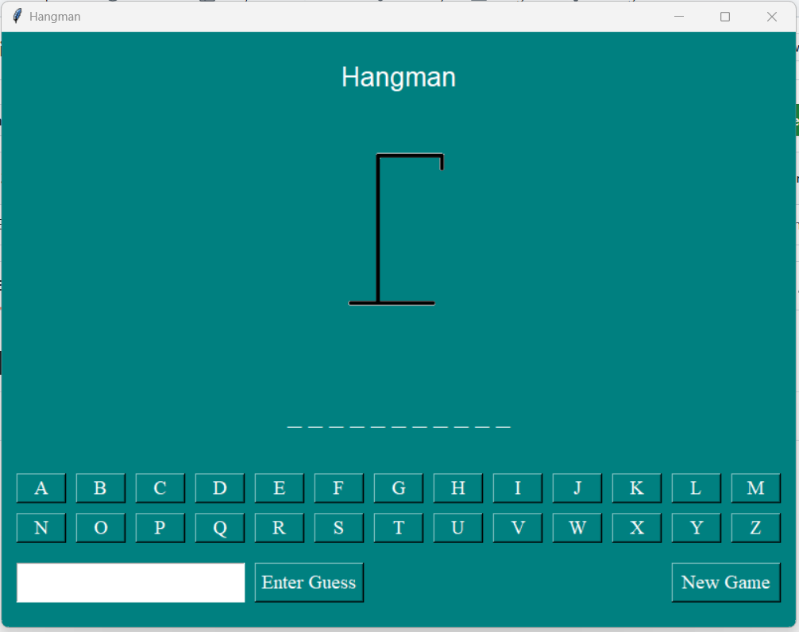

# Tkinter: Hangman

## Objective:
Design and implement a Hangman game GUI using Python and the Tkinter library. This assignment aims to solidify your understanding of:
    * GUI development with Tkinter
    * Widget creation and placement
    * Event handling and user interaction
    * Game logic implementation

## Description:
You will create a Hangman game with a graphical user interface (GUI) using Tkinter. The game will include the following widgets:

    * Title (Label)
    * Hangman Image (Label)
    * Message (Label)
    * Dashes (Label)
    * Letter Buttons (Button)
    * Guess Entry (Entry)
    * Enter Guess Button (Button)
    * New Game Button (Button)

You are expected to implement the game logic and connect it to the GUI elements.

## Phase 1: GUI Setup 
    * Create the main game window using Tk().
    * Set the title and dimensions of the window.
    * Create the following widgets and place them in the window using a layout manager (e.g., grid, pack, place):
        * Title Label: Display the title of the game (e.g., "Hangman").
        * Hangman Image Label: Display a placeholder image for the Hangman figure.  You can use a series of images (e.g., "hangman0.png", "hangman1.png", etc.) and update this label as the game progresses.  For this initial phase, you can use a single placeholder image.
        * Message Label: Display messages to the user (e.g., instructions, feedback on guesses).
        * Dashes Label: Display the hidden word as a series of dashes (e.g., "_ _ _ _").
        * Letter Buttons: Create buttons for each letter of the alphabet.  Use a loop to create these buttons and arrange them in a grid layout.
        * Guess Entry: Allow the user to enter a letter or a word as their guess.
        * Enter Guess Button:  When clicked, this button will process the user's guess.
        * New Game Button: Start a new game.
    * Ensure that the GUI layout is organized and user-friendly.

## Phase 2: Game Logic Implementation 
    * Implement the following game logic:
        * Word Selection:
            * Create a list of words to be used in the game.
            * Randomly select a word from the list when the "New Game" button is clicked.
        * Dashes Display:
            * Create a function to generate a string of dashes representing the hidden word.
            * Update the "Dashes Label" with the current state of the hidden word.
        * Guess Processing:
            * When the "Enter Guess" button is clicked, retrieve the user's input from the "Guess Entry" widget.
            * Validate the input to ensure it is either a single letter or the complete word.
            * If the input is a single letter:
                * Check if the letter is in the secret word.
                * If it is, reveal the letter in the "Dashes Label" and update the display.
                * If it is not, increment the incorrect guess count and update the Hangman image.
            * If the input is the complete word:
                * Check if the word matches the secret word.
                * If it matches, the player wins.
                * If it does not match, increment the incorrect guess count and update the Hangman image.
        * Game Over:
            * Determine when the game is over (either the player wins or loses).
            * Display an appropriate message in the "Message Label" (e.g., "You win!", "You lose! The word was ...").
            * Disable the letter buttons and the "Guess Entry" widget after the game is over.
        * New Game:
            * When the "New Game" button is clicked:
                * Reset the game state (select a new word, reset dashes, incorrect guess count, etc.).
                * Update the GUI to reflect the new game state (clear the message, display initial dashes, reset the Hangman image).
                * Enable the letter buttons and the "Guess Entry" widget.
    * Ensure that the game logic is implemented correctly and handles all possible scenarios.

## Phase 3: Error Handling and User Experience 
    * Implement error handling to handle invalid user input (e.g., entering multiple letters or invalid characters).  Display informative messages to the user.
    * Improve the user experience by:
        * Providing clear instructions and feedback to the user throughout the game.
        * Disabling guessed letters.
        * Adding visual enhancements (e.g., changing button colors, fonts, etc.).

## Details 
### Behavior 
**Gameplay** 

In our implementation of Hangman, the computer will take on the role of the "chooser" and the  human player will be the "guesser." The computer will secretly choose a word from a list (see  below) and show the player how many letters are in the word by displaying a sequence of  blanks (underscores). Then, the computer will begin asking for guesses. If the player guesses a  letter that is in the secret word, all blanks representing an instance of that letter should be  replaced by the letter. If the guessed letter is not in the word at all, the player should lose a  chance and a new part of the Hangman figure should appear. If the player guesses a letter he or  she has already guessed, he or she should not lose a chance, even if that letter is not in the  word. If the player guesses all letters in the word, he or she wins. If the Hangman figure is  completed, the player loses. In either case, the secret word should be revealed after the game  is over.

**Word Status:** 

As the game is played, the player should be shown the current guessed status of the secret word. Letters that have been correctly guessed should be shown in the correct locations.  Unguessed letters will appear as blanks. At the beginning of the game, no letters will have been  guessed, and the only information shown to the player will be a sequence of blanks, with one  blank for each letter in the secret word. As the player guesses letters correctly, blanks representing guessed letters should be replaced by those letters. So, for example, if the secret  word is "screwdriver" and the player has guessed 'e,' 's', 'r', and 'd,' the current word status  would be "s r e d r e r". 

**Chances/The Hangman:** 

The player will have six "chances" to guess the word. Guessing a correct letter does not cost a  chance. Each missed chance will cause a new piece of the Hangman to appear. The six pieces of  the Hangman are: head, body, left arm, right arm, left leg, right leg. 

**Game End:** 

The game can end in one of two ways: 
- If the player has guessed the complete secret word, he or she wins. 
- Otherwise, if the player has run out of chances and the complete Hangman has been drawn, the player loses.

In either case, when the game ends the host should stop asking for guesses. The host should  inform the player whether he or she won or lost, and the assistant should reveal the entire  secret word.

